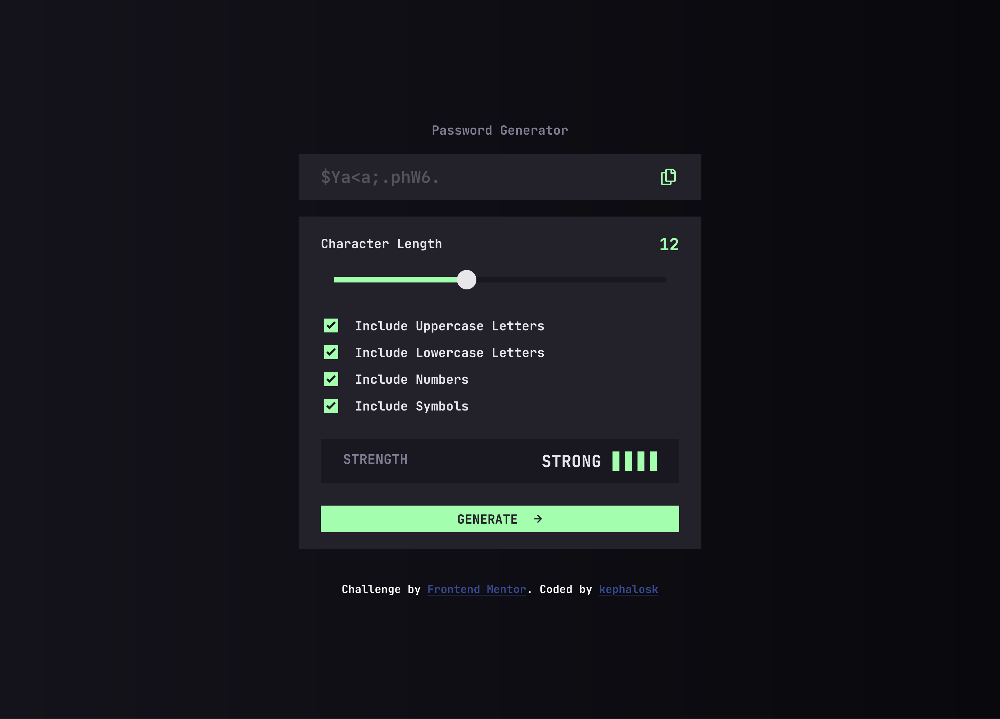
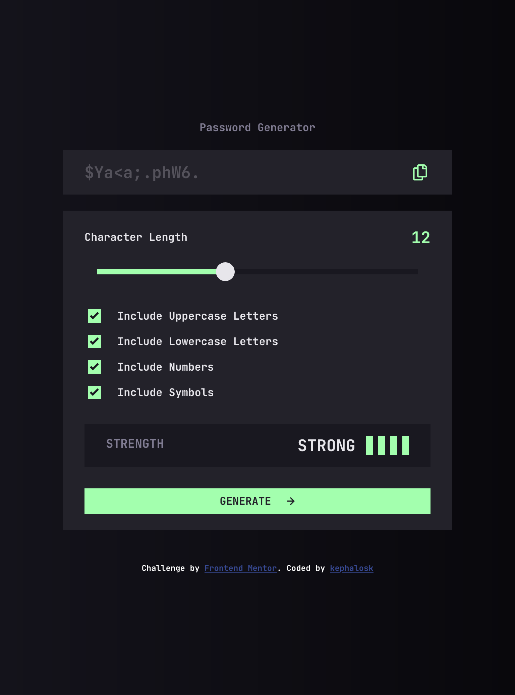
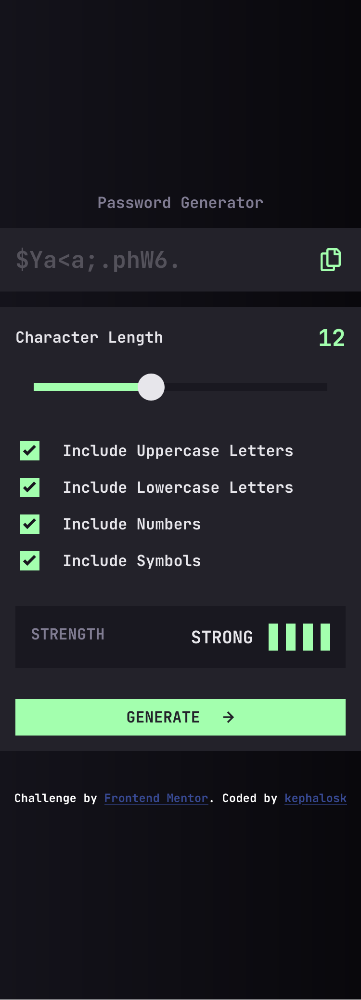
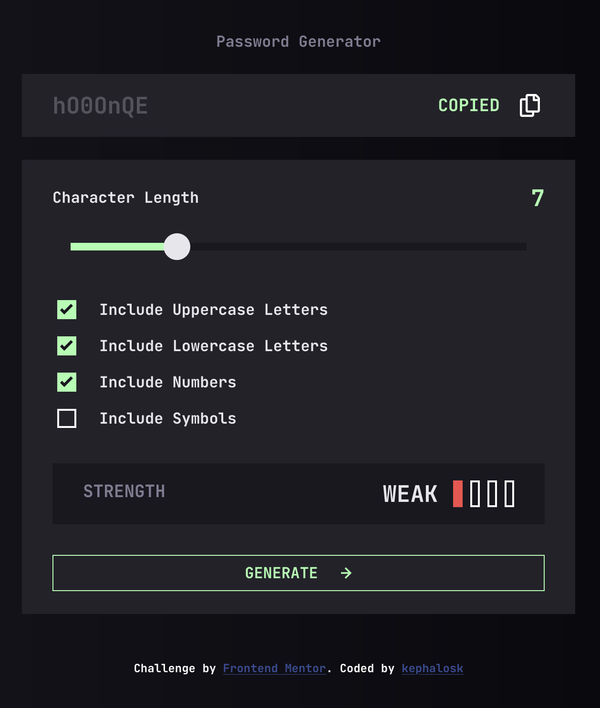
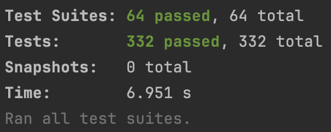
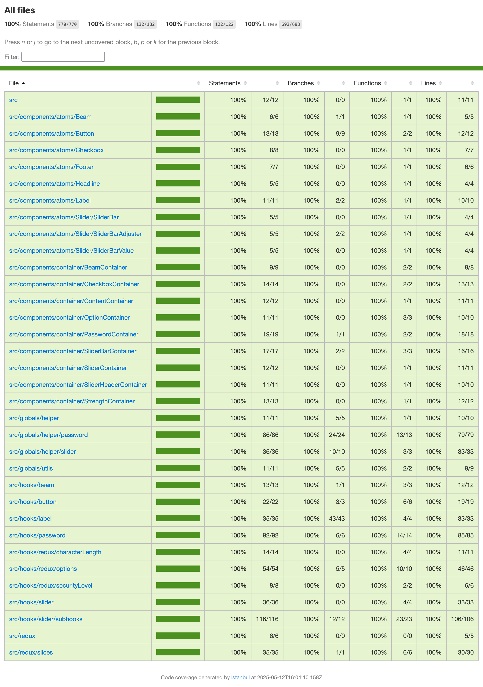

# Frontend Mentor - Time tracking dashboard solution

This is a solution to the [Password generator app challenge on Frontend Mentor](https://www.frontendmentor.io/challenges/password-generator-app-Mr8CLycqjh). Frontend Mentor challenges help you improve your coding skills by building realistic projects.

To run this project:

1. clone Repo
2. check node version (v20.18.4) and npm version (v10.7.0)
3. run: npm install
4. run: npm run dev
5. for unit tests run: npm run test

## Table of contents

- [Overview](#overview)
    - [Screenshots](#screenshots)
    - [Links](#links)
- [Coverage](#coverage)
- [My process](#my-process)
- [Built with](#built-with)
- [Author](#author)

## Overview

### Screenshots

Desktop

Tablet

Mobile

Active

### Links

- Solution URL: [GitHub Repo](https://github.com/kephalosk/password-generator-app )
- Live Site URL: [GitHub Pages](https://kephalosk.github.io/password-generator-app )

## Coverage

## My process

- download project files
- setup project with React/Vite/SWC/TypeScript/Jest
- check ux design
- recreate index.html
- create scss styles
- identify components
- create atom and container components
- create components s/css classes
- create components constants
- outsource component logic in hooks
- write unit tests
- open html in browser
- polish layout
- refactor javascript/typescript code
- clean up code semantically
- add screenshots
- update README
- clean up project
- upload solution

## Built with

- React/Vite/SWC/TypeScript/Jest/Redux
- SCSS custom properties
- Flexbox
- a11y friendly
- Mobile-first workflow

## Author

- Website - [GitHub Account](https://github.com/kephalosk/)
- Frontend Mentor - [@kephalosk](https://www.frontendmentor.io/profile/kephalosk)